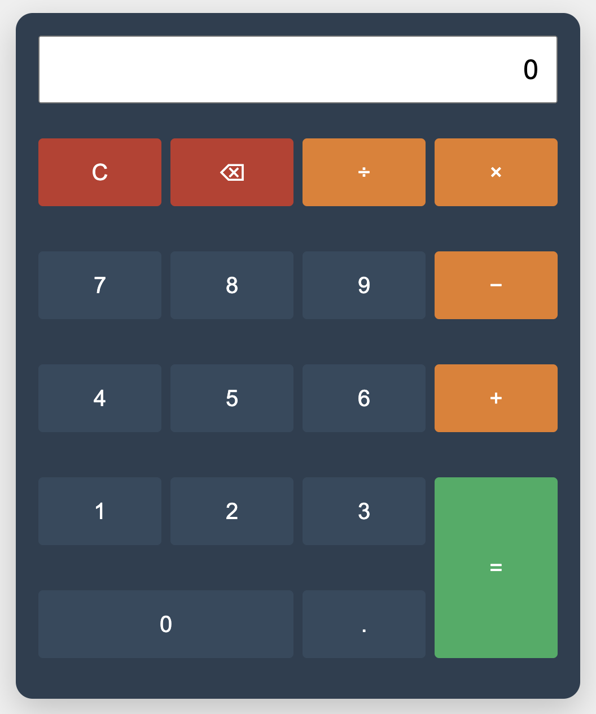

# Calculator

A clean and modern calculator web application with keyboard support, built with GitHub Copilot in VS Code following a Coursera course, with additional personal enhancements.

## Project Background

This calculator was developed as part of a learning journey using GitHub Copilot for AI-assisted coding (vibe coding). The project started as a basic calculator from a Coursera course and was enhanced with additional features and improvements.

### Development Progression

1. Initial Setup
   - Basic HTML structure with number pad layout
   - Simple CSS styling for calculator appearance
   - Basic JavaScript for number input

2. Core Functionality
   - Added arithmetic operations
   - Implemented calculation logic
   - Added clear button functionality

3. Personal Enhancements
   - Added keyboard support for all operations
   - Implemented backspace functionality
   - Added decimal point support
   - Improved operator display in input field
   - Enhanced visual design with modern color scheme
   - Made the calculator fully responsive

## Features

- Basic arithmetic operations (add, subtract, multiply, divide)
- Keyboard support
- Backspace functionality
- Decimal number support
- Clear function
- Responsive design

## Keyboard Shortcuts

- Numbers: `0-9`
- Operators: `+`, `-`, `*`, `/`
- Equals: `Enter` or `=`
- Clear: `Escape`
- Backspace: `Backspace`
- Decimal: `.`

## Technologies Used

- HTML5
- CSS3
- JavaScript
- GitHub Copilot
- Visual Studio Code
